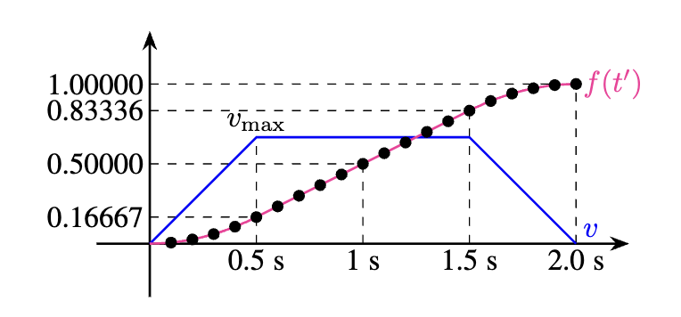

# RKD Capstone Project:

## Video Demonstration
🔗 *([Video Demo](https://youtu.be/k4Xcv1jUgHI))*

## Overview
This capstone project involves programming a **Franka Emika Panda** robot to autonomously **pick up a pen, move it to a whiteboard, draw lines and curves, and place the pen in a drop bin**. The robot must successfully complete this sequence three times while adapting to different pen locations, whiteboard positions, and orientations.

The project focuses on **robot kinematics, inverse kinematics (IK), trajectory generation, and collision avoidance**, showcasing our approach to **robot motion planning in constrained environments**.

## Key Features
- **Pen Grasping & Handling** – The robot uses its gripper to pick up a pen from a holder and properly orient it for drawing.
- **Forward Kinematics** – Implemented DH parameters for accurate kinematic transformations.
- **Gradient Descent for Inverse Kinematics** – Used iterative optimization techniques to solve inverse kinematics efficiently, ensuring fast convergence and smooth and accurate end-effector positioning.
- **Trajectory Planning** – Used **joint-space and Cartesian-space interpolation** to generate smooth and precise drawing motions.
- **Time-Parameterized Motion Planning** – Implemented smooth velocity profiles with **S-curve motion planning** to ensure gradual acceleration and deceleration, reducing torque spikes and improving trajectory stability.
- **Collision Avoidance** – Ensured safe movement by avoiding obstacles such as the table, pen holder, and whiteboard.
- **Drawing Execution** – Successfully traced lines and arbitrary curves while maintaining pen contact with the whiteboard.
- **Adaptive Placement** – The robot adapts to varying pen and board positions, placing the pen securely in a drop location after use.
- **Human-in-the-loop Recovery** – Allows manual inputs to recover from errors like failed grasping or misalignment.


### S-Curve Velocity Profile

To ensure smooth acceleration and deceleration, we implemented an S-curve motion planning approach, as shown alongside the standard trapezoidal trajectory profile in the diagram below:



The trapezoidal profile faces instantaneous acceleration and discontinuities at the transition points, leading to increased torque-demands on the motors. 
To resolve this, we smoothly varied the time parameter passed to the interpolation function, allowing for gradual changes in acceleration. This improved trajectory stability by keeping acceleration and jerk within feasible limits.

## Project Structure
```
📂 rkd-capstone/
│── 📁 src/            # Source code for motion planning, kinematics, and control
│── 📁 config/         # Configuration files, calibration parameters
│── 📁 docs/           # Writeup, reports, and documentation
│── 📄 README.md       # This file
```
